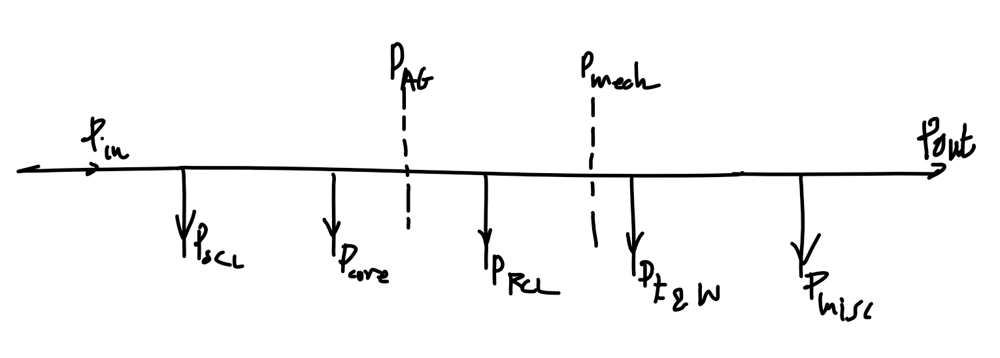
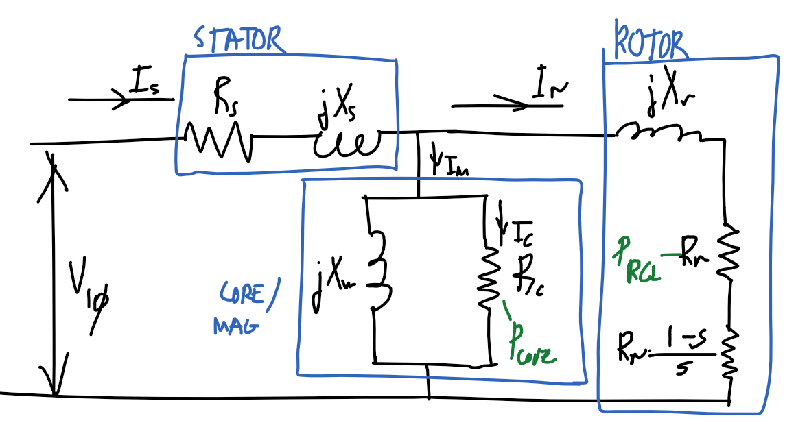
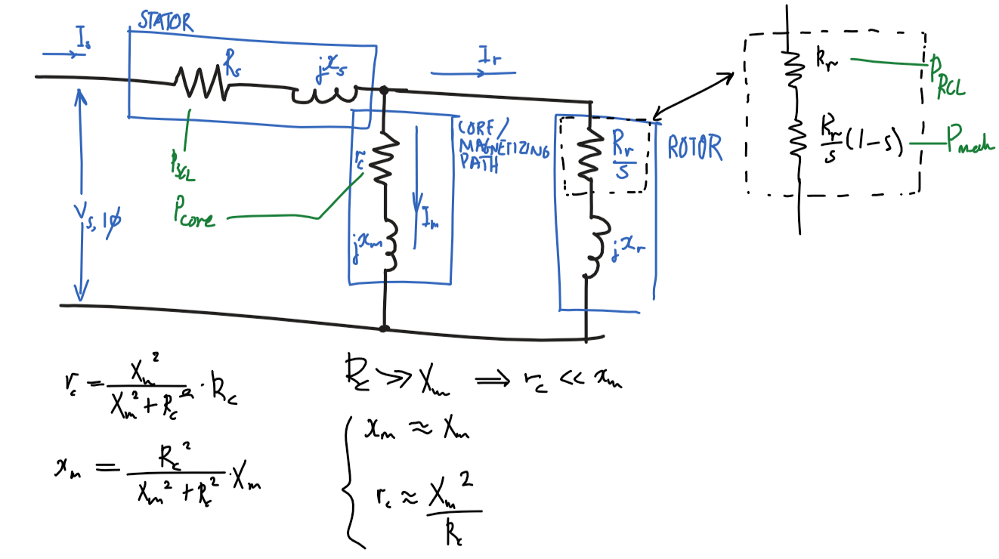
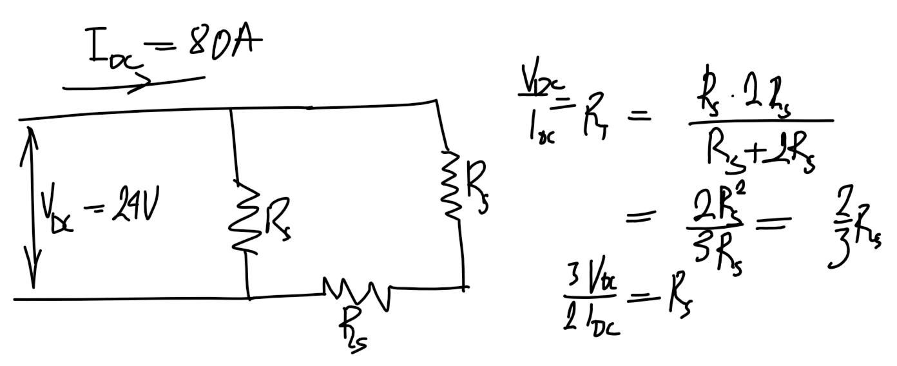
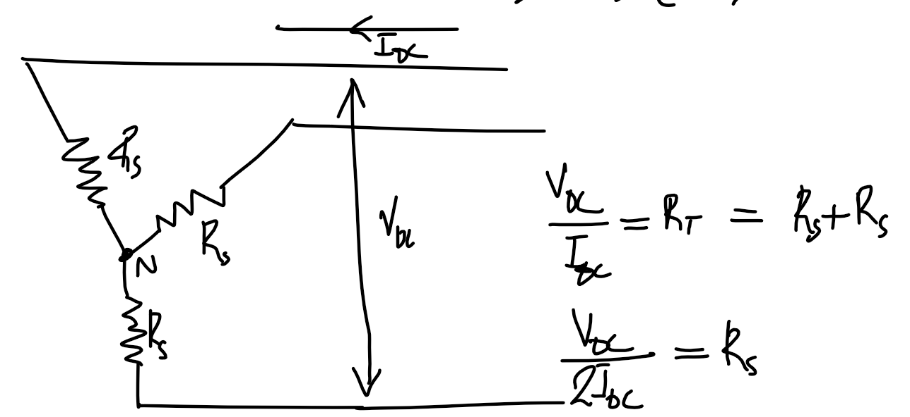
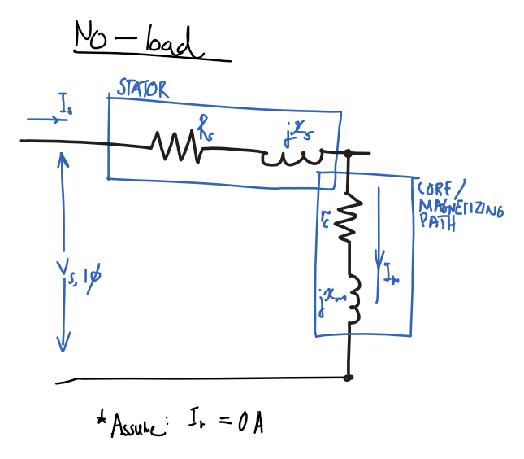
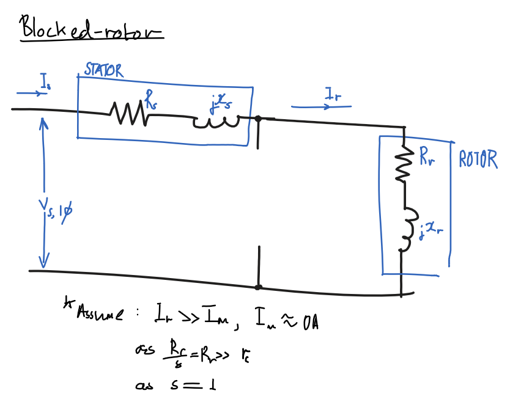
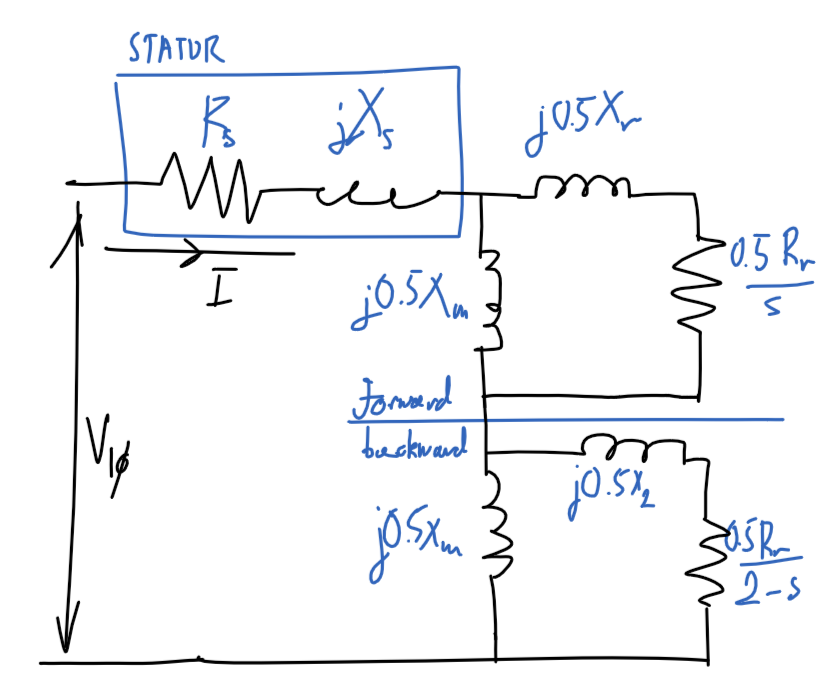
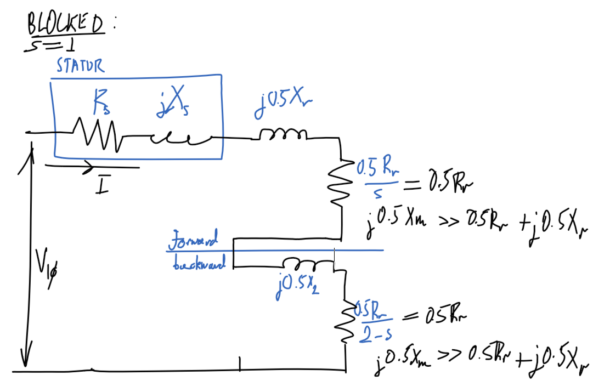
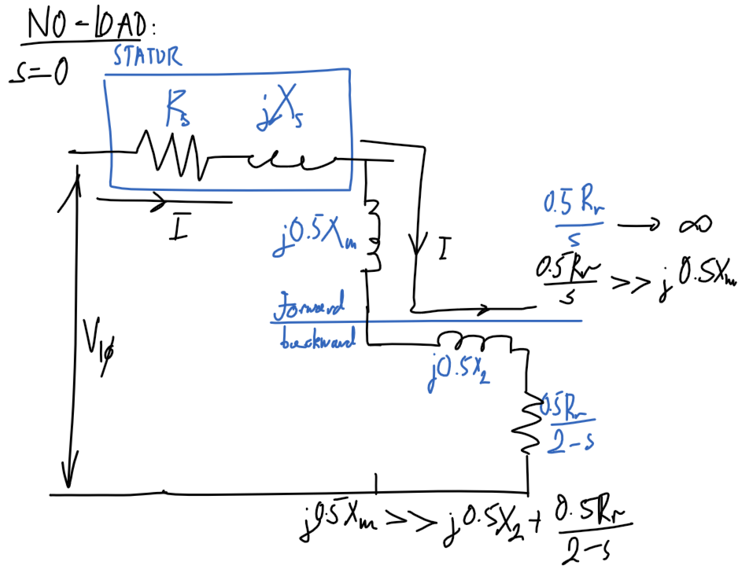

> Why are the drawings bad?

I draw them with a mouse

### Types of power factors (From `ENSC2003`)

Where $\bar{S}=|\bar{S}|\angle\varphi$:

$$ \varphi = \arctan\left(\frac{Q}{P}\right) = \theta_v-\theta_i$$

|             | Lagging        | Leading       | Unity        |
| ----------- | -------------- | ------------- | ------------ |
| Voltage     | Current behind | Current ahead | In phase     |
| Load type   | Inductive      | Capacitive    | Resistive    |
| $Q$         | $Q>0$          | $Q<0$         | $Q=0$        |
| $\varphi$   | $\varphi>0°$   | $\varphi<0°$  | $\varphi=0°$ |
| PF [Load]   | $[0,1)$        | $[0,1)$       | $1$          |
| PF [Source] | $[0,-1)$       | $[0,-1)$      | $-1$         |

## Power types in motor

| Type               | Description                                                                                                      | Equivalent terms                                                                                               |
| ------------------ | ---------------------------------------------------------------------------------------------------------------- | -------------------------------------------------------------------------------------------------------------- |
| Input power        | Power into machine. $V_T=V_{3\phi}$, $I_L=I_{3\phi}$                                                             | $P_\text{in}$, $\sqrt{3}V_TI_L\cos(\theta)$                                                                    |
| Output power       | Mechanical output power of the machine, excludes losses                                                          | $P_\text{out}$, $P_\text{load}$                                                                                |
| Converted power    | Total electrical power converted to mechanical power, includes useful power and mechanical losses inside machine | $P_\text{conv}$, $P_\text{converted}$, $P_\text{mech}$, $P_\text{developed}$, $\tau_\text{mech}\times\omega_m$ |
| Airgap power       | Power transmitted over airgap.                                                                                   | $P_\text{AG}$, $\tau_\text{mech}\times\omega_s$                                                                |
| Mechanical loss    | Power lost to friction and windage                                                                               | $P_\text{mechanical loss}$, $P_\text{F\\\&W}$, $P_\text{friction and windage}$                                 |
| Core loss          | Power lost in machine magnetic material due to hysteresis loss and eddy currents                                 | $P_\text{core}$                                                                                                |
| Rotor copper loss  | Due to resistance of rotor windings                                                                              | $P_r$, $P_\text{RCL}$                                                                                          |
| Stator copper loss | Due to resistance of stator windings                                                                             | $P_s$, $P_\text{SCL}$                                                                                          |
| Miscellaneous loss | Add 1% to losses to account for other unmeasured losses                                                          | $P_\text{misc}$, $P_\text{stray}$                                                                              |

$$
\begin{align}
P_\text{in}&=P_\text{SCL}+P_\text{RCL}+P_\text{core}+P_\text{F\\\&W}+P_\text{misc}+P_\text{out}\\
P_\text{AG}&=P_\text{RCL}+P_\text{F\\\&W}+P_\text{misc}+P_\text{out}\\
P_\text{mech}&=P_\text{F\\\&W}+P_\text{misc}+P_\text{out}
\end{align}
$$

Note - assume loss is 0 if not mentioned!

| Type                      | Description                                 | Symbols                                 |
| ------------------------- | ------------------------------------------- | --------------------------------------- |
| Load torque, Shaft torque | Torque experienced by load after all losses | $\tau_\text{load}$, $\tau_\text{shaft}$ |

## $3\phi$ induction motor

### Etc.

- Slip speed $N_\text{slip}=N_{s\text{ (sync)}}-N_r=sN_{s\text{ (sync)}}$

- "1/4 of rated load" != "1/4 times full load"
  - Means 1/4 of full load slip as it is in the linear region. Accounts for the minimum load.
- Rated power stated in machine specification refers to the output power $P_\text{out}$, and excludes all losses.
- Speed regulation using machine speed: $$\text{SR}=\frac{N_{r,\text{NL}}-N_{r,\text{FL}}}{N_{r,\text{FL}}}$$

### Diagram

### Equivalent model

#### Assumptions

- $x_m\approx X_m$
  - $R_c\ggg X_m\Rightarrow r_c\lll x_m$
  - $x_m=\frac{{R_c}^2}{{R_c}^2+{X_m}^2}X_m\approx\frac{\cancel{{R_c}^2}}{\cancel{{R_c}^2}}X_m=X_m$
- $r_c\approx {X_m}^2/R_c$
  - $R_c\ggg X_m\Rightarrow r_c\lll x_m$
  - $r_c=\frac{{X_m}^2}{{R_c}^2+{X_m}^2}R_c\approx\frac{{X_m}^2}{{R_c}^2}R_c=\frac{{X_m}^2}{R_c}$

### Diagram

### DC test

#### $\Delta$ machine

$$R_s=\frac{3}{2}\cdot\frac{V_{\text{DC},3\phi}}{I_{\text{DC},3\phi}}$$

#### Y machine

$$R_s=\frac{1}{2}\cdot\frac{V_{\text{DC},3\phi}}{I_{\text{DC},3\phi}}$$

### No-load test

#### Assumptions

- $P_\text{out}=0$
  - No output power as no load.
- $R_r/s=\infty$ and $I_r=0$
  - Infinite rotor resistance, ignore rotor path.

#### Diagram

Using assumptions, remove rotor part of circuit and only consider stator and magnetizing path.

### Blocked rotor test

#### Assumptions

- Ignore magnetizing path, $I_m=0$
  - $I_r\ggg I_m$ as $R_r/s\ggg Z_m$
- $R_r/s=R_r$, $s=1$
  - Slip is $1$ as rotor is blocked.
- $x_s=x_r'$
  - Same number of turns in stator and rotor
- and $x_r=f_0/f_\text{BL} \times x_r'$
  - Note: $x_r'$ is the inductance at $f_\text{BL}$, the blocked rotor test frequency which is less than the nominal frequency $f_0$

#### Diagram

Ignore magnetizing path

---

## Single-phase induction motor

### Diagram

### Blocked-rotor

#### Diagram

### No-load

#### Diagram

