# ENSC3016 notes

### Etc

#### FIRST-PASS CHECKS

- Double check all are in the correct phase! Multiplications and divisions by $\sqrt{3}$ or $3$ where necessary must be checked! Try annotating everything that does not have an associated phase.
- Check conjugate in current. $\bar{S}=\bar{V}\bar{I}^*$
- Check transformer parameters are referred to the proper side

#### Y-$\Delta$ transformation (Balanced case)

$Z_\Delta=3Z_Y$

### Types of power factors (From `ENSC2003`)

Where $\bar{S}=|\bar{S}|\angle\varphi$:

$$ \varphi = \arctan\left(\frac{Q}{P}\right) = \theta_v-\theta_i$$

|             | Lagging        | Leading       | Unity        |
| ----------- | -------------- | ------------- | ------------ |
| Voltage     | Current behind | Current ahead | In phase     |
| Load type   | Inductive      | Capacitive    | Resistive    |
| $Q$         | $Q>0$          | $Q<0$         | $Q=0$        |
| $\varphi$   | $\varphi>0°$   | $\varphi<0°$  | $\varphi=0°$ |
| PF [Load]   | $[0,1)$        | $[0,1)$       | $1$          |
| PF [Source] | $[0,-1)$       | $[0,-1)$      | $-1$         |

## Power types in induction motor

| Type               | Description                                                                                                      | Equivalent terms                                                                                               |
| ------------------ | ---------------------------------------------------------------------------------------------------------------- | -------------------------------------------------------------------------------------------------------------- |
| Input power        | Power into machine. $V_T=V_{3\phi}$, $I_L=I_{3\phi}$                                                             | $P_\text{in}$, $\sqrt{3}V_TI_L\cos(\theta)$                                                                    |
| Output power       | Mechanical output power of the machine, excludes losses                                                          | $P_\text{out}$, $P_\text{load}$                                                                                |
| Converted power    | Total electrical power converted to mechanical power, includes useful power and mechanical losses inside machine | $P_\text{conv}$, $P_\text{converted}$, $P_\text{mech}$, $P_\text{developed}$, $\tau_\text{mech}\times\omega_m$ |
| Airgap power       | Power transmitted over airgap.                                                                                   | $P_\text{AG}$, $\tau_\text{mech}\times\omega_s$                                                                |
| Mechanical loss    | Power lost to friction and windage                                                                               | $P_\text{mechanical loss}$, $P_\text{F\\\&W}$, $P_\text{friction and windage}$                                 |
| Core loss          | Power lost in machine magnetic material due to hysteresis loss and eddy currents                                 | $P_\text{core}$                                                                                                |
| Rotor copper loss  | Due to resistance of rotor windings                                                                              | $P_r$, $P_\text{RCL}$                                                                                          |
| Stator copper loss | Due to resistance of stator windings                                                                             | $P_s$, $P_\text{SCL}$                                                                                          |
| Miscellaneous loss | Add 1% to losses to account for other unmeasured losses                                                          | $P_\text{misc}$, $P_\text{stray}$                                                                              |

$$
\begin{align}
P_\text{in}&=P_\text{SCL}+P_\text{RCL}+P_\text{core}+P_\text{F\\\&W}+P_\text{misc}+P_\text{out}\\
P_\text{AG}&=P_\text{RCL}+P_\text{F\\\&W}+P_\text{misc}+P_\text{out}\\
P_\text{mech}&=P_\text{F\\\&W}+P_\text{misc}+P_\text{out}
\end{align}
$$

Note - assume loss is 0 if not mentioned!

| Type                      | Description                                 | Symbols                                 |
| ------------------------- | ------------------------------------------- | --------------------------------------- |
| Load torque, Shaft torque | Torque experienced by load after all losses | $\tau_\text{load}$, $\tau_\text{shaft}$ |

## $3\phi$ induction motor

### Etc.

- Slip speed $N_\text{slip}=N_{s\text{ (sync)}}-N_r=sN_{s\text{ (sync)}}$

- "1/4 of rated load" != "1/4 times full load"
  - Means 1/4 of full load slip as it is in the linear region. Accounts for the minimum load.
- Rated power stated in machine specification refers to the output power $P_\text{out}$, and excludes all losses.
- Speed regulation using machine speed: $$\text{SR}=\frac{N_{r,\text{NL}}-N_{r,\text{FL}}}{N_{r,\text{FL}}}$$

### Diagram

### Equivalent model

#### Assumptions

- $x_m\approx X_m$
  - $R_c\ggg X_m\Rightarrow r_c\lll x_m$
  - $x_m=\frac{{R_c}^2}{{R_c}^2+{X_m}^2}X_m\approx\frac{\cancel{{R_c}^2}}{\cancel{{R_c}^2}}X_m=X_m$
- $r_c\approx {X_m}^2/R_c$
  - $R_c\ggg X_m\Rightarrow r_c\lll x_m$
  - $r_c=\frac{{X_m}^2}{{R_c}^2+{X_m}^2}R_c\approx\frac{{X_m}^2}{{R_c}^2}R_c=\frac{{X_m}^2}{R_c}$

### Diagram

### DC test

#### $\Delta$ machine

$$R_s=\frac{3}{2}\cdot\frac{V_{\text{DC},3\phi}}{I_{\text{DC},3\phi}}$$

#### Y machine

$$R_s=\frac{1}{2}\cdot\frac{V_{\text{DC},3\phi}}{I_{\text{DC},3\phi}}$$

### No-load test

#### Assumptions

- $P_\text{out}=0$
  - No output power as no load.
- $R_r/s=\infty$ and $I_r=0$
  - Infinite rotor resistance, ignore rotor path.

#### Diagram

Using assumptions, remove rotor part of circuit and only consider stator and magnetizing path.

### Blocked rotor test

#### Assumptions

- Ignore magnetizing path, $I_m=0$
  - $I_r\ggg I_m$ as $R_r/s\ggg Z_m$
- $R_r/s=R_r$, $s=1$
  - Slip is $1$ as rotor is blocked.
- $x_s=x_r'$
  - Same number of turns in stator and rotor
- and $x_r=f_0/f_\text{BL} \times x_r'$
  - Note: $x_r'$ is the inductance at $f_\text{BL}$, the blocked rotor test frequency which is less than the nominal frequency $f_0$

#### Diagram

Ignore magnetizing path

---

## Single-phase induction motor

### Diagram

### Blocked-rotor

#### Diagram

### No-load

#### Diagram

## Synchronous machine

### Etc

$$E_A=V_{1\phi}-I_A(R_A+j X_s)$$
$$I_A=\text{CONJUGATE}\left(\frac{|S_{3\phi}|\angle\arccos(x)}{3V_{1\phi}}\right), \begin{cases}x=+\text{PF} && \text{lagging} \\ x=-\text{PF} && \text{leading}\end{cases}$$

### Voltage regulation

$$\text{VR}=\frac{|V_\text{NL}|-|V_\text{FL}|}{|V_\text{FL}|}=\frac{|E_A|-|V_{1\phi,\text{rated}}|}{|V_{1\phi,\text{rated}}|}$$

- $V_\text{FL}$ is the full-load voltage which is the full-load/maximum rated voltage at the output terminal.
- Calculate $E_A$ at full load by calculating the current as shown above.
- $V_\text{NL}$ is the no-load voltage, which in the no-load case will be $E_A$.

| No-load                                                          | Full-load                                                        |
| ---------------------------------------------------------------- | ---------------------------------------------------------------- |
| 
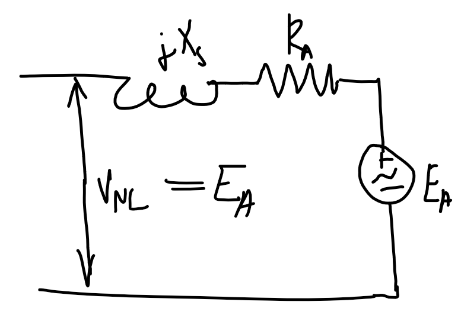
 | 
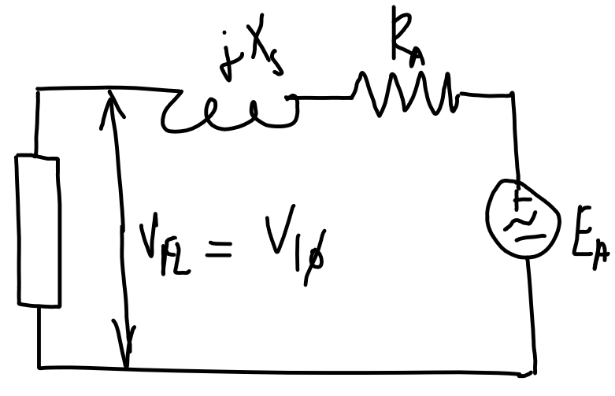
 |

| PF  | Lagging  | Unity  | Leading  |
| --- | -------- | ------ | -------- |
| VR  | Positive | Near 0 | Negative |

### Open and short circuit test

#### **Note** - double-check if the axis refers to per-phase or line voltage/current.

| Open-circuit test                                                 | Short-circuit test                                               |
| ----------------------------------------------------------------- | ---------------------------------------------------------------- |
| 
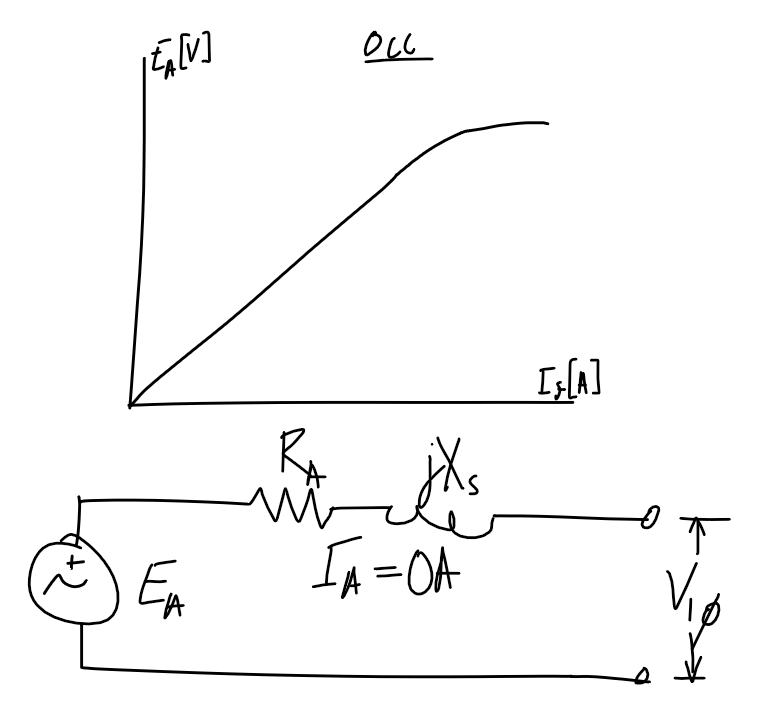
 | 
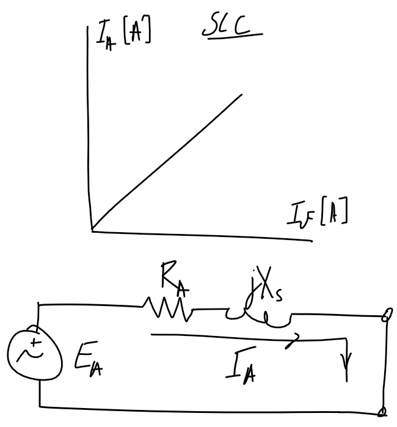
 |

### Power flow

$P_\text{out}$ is the rated power
$$P_\text{out}=S_\text{rated}\times \text{PF}$$

$$
\begin{align}
P_\text{in}&=P_\text{copper}+P_\text{core}+P_\text{F\\\&W}+P_\text{misc}+P_\text{out}\\
P_\text{mech}&=P_\text{F\\\&W}+P_\text{misc}+P_\text{out}
\end{align}
$$

---

### Magnetic circuit analogy

| Magnetic circuit                    | name                         |     | Electrical circuit       | name                    |
| ----------------------------------- | ---------------------------- | --- | ------------------------ | ----------------------- |
| $$\mathcal F$$                      | Magnetomotive force [A-turn] |     | $$\mathcal E$$           | Electromotive force [V] |
| $$\mathcal R$$                      | Reluctance [1/H]             |     | $$R$$                    | Resistance [$\Omega$]   |
| $$\Phi$$                            | Magnetic flux [Wb]           |     | $$I$$                    | Current [A]             |
| $$\mathcal P=\frac{1}{\mathcal R}$$ | Permeance [H]                |     | $$G=\frac{1}{R}$$        | Conductivity [$\mho$]   |
| $$\mathcal F=\Phi\mathcal R$$       | Hopkinson's law              |     | $$V=IR$$                 | Ohm's law               |
| $$\mathcal R=\frac{l}{\mu A}$$      |                              |     | $$R=\frac{l}{\sigma A}$$ |

---

### Transformers

$$Z_P=Z_S\left(\frac{N_P}{N_S}\right)^2=Z_S n^2$$

#### Maximum power.

If load is resistive ($jX_\text{load}=0$) then for maximum power transfer:

$$R_\text{load}=|{R_\text{src}}^2+j{X_\text{src}}^2|$$

#### Parameter identification

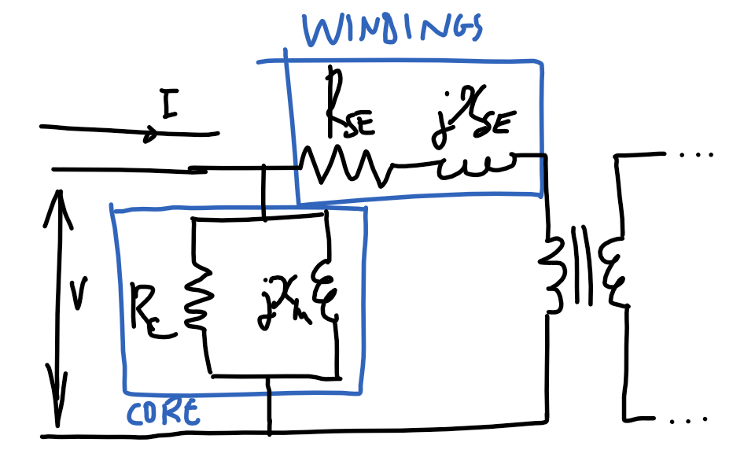

| Open-circuit test                                                | Short-circuit test                                               |
| ---------------------------------------------------------------- | ---------------------------------------------------------------- |
| 
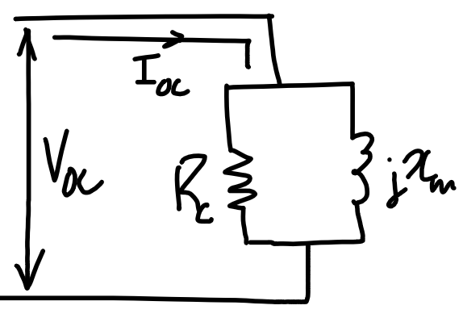
 | 
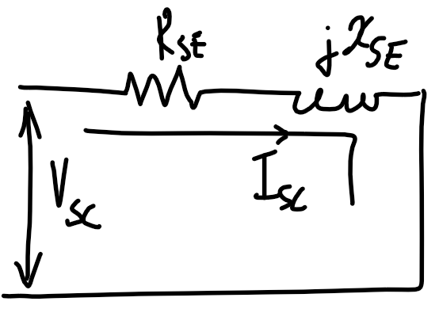
 |

#### Voltage regulation

$$\text{VR}=\frac{|V_\text{NL,P}|-|V_\text{rated,P}|}{|V_\text{rated,P}|}=\frac{|V_\text{in}|-|V_\text{rated,P}|}{|V_\text{rated,P}|}$$

Ignore shunt resistance. Refer from primary side. Use KVL to determine $V_\text{in}$.

Voltage regulation is typically small.

$$|V_\text{in}|=|V_\text{rated,P}+I_\text{L,P}\cdot\bar Z|$$

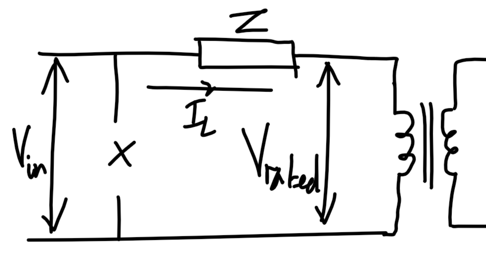

### DC machine

| Separately excited machine                           | Shunt excited                                                     | Series excited                                                                    |
| ---------------------------------------------------- | ----------------------------------------------------------------- | --------------------------------------------------------------------------------- |
| 
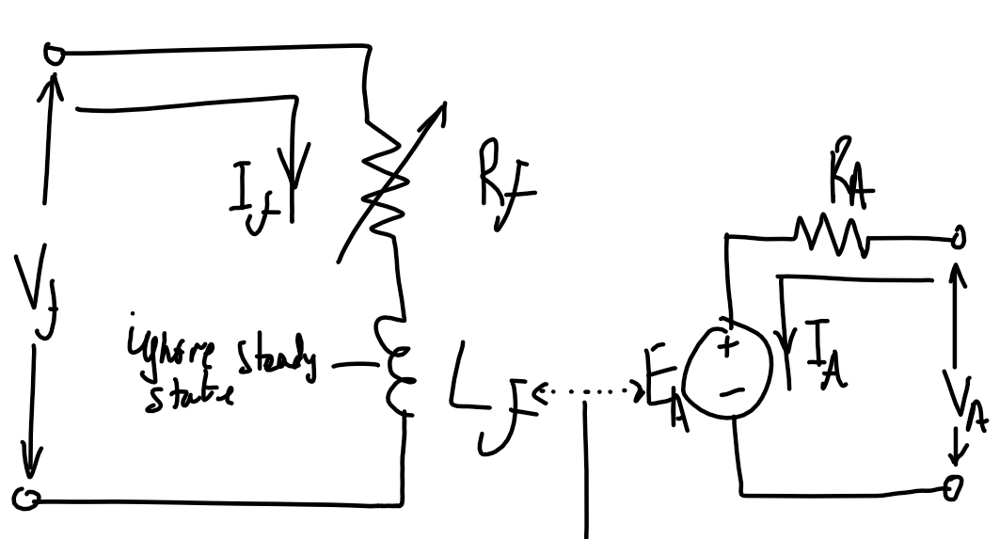
 | 
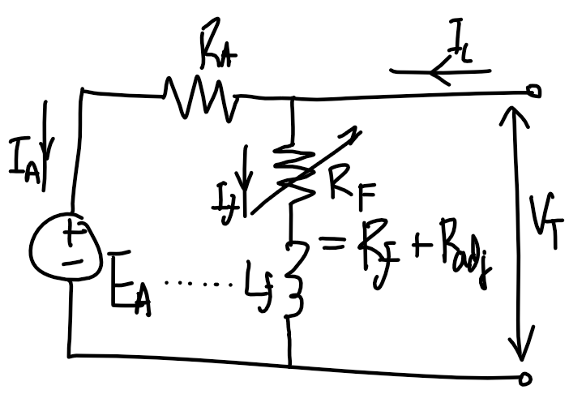
              | 
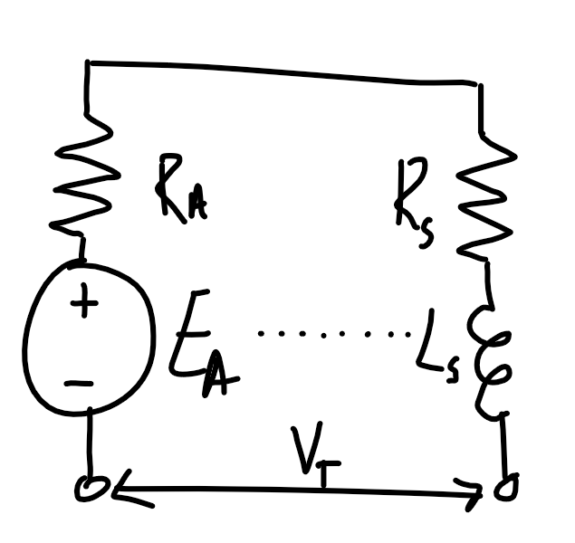
                              |
|                                                      | Similar torque-speed characteristic to separately-excited machine | High torque per ampere. Used in high-torque applications                          |
| Requires two independent voltage sources             |                                                                   | Do not run unloaded - infinite speed at 0 torque as $\omega\propto 1/\sqrt{\tau}$ |
| Motor control using $R_f$                            | Motor control using $R_F$                                         | Motor control using $V_T$.                                                        |

#### Starting DC motors

$R_A$ might need to be adjusted so it is high initially in large DC motors, as the starting current is high since there is no back-emf created by $E_A$.

#### Magnetizating curve

When a question specifies the field current or $R_\text{adj}$, refer to magnetization curve. Magnetizating curve is valid at a specific speed $n_{m1}$, and the curve is used to find $E_{A1}$. Using the load condition to find the armature current $I_A=\tau_\text{ind}/(K\varPhi)$, $V_A$ can be used to find a second induced EMF $E_{A2}$. Using $E_{A2}$ find the speed $n_{m2}$ by scaling $n_{m1}$ by $E_{A2}/E_{A1}$.

#### Idk

$$P_\text{mech}=E_AI_A$$

No-load separately excited machine. Assuming no mechanical losses.

$$E_A=V_A\text{ (No load)}$$
$$I_A=0\text{ (No load)}$$

Armature reaction causes increase in speed and causes instability as the core saturates near the poles. Can be reduced with compensating winding which is in series with the armature coil.

$$K\Phi\omega=E_A$$
$$K\Phi I_A=\tau$$

For shunt motor

$$K\Phi=\frac{V_T-R_AI_A}{\omega}$$
$$\tau=K\Phi I_A=\frac{V_T-R_AI_A}{\omega}I_A$$

Assume no saturation, speed locked(?):

This doesn't seem right. We are meant to use the machine constant and the proportionality of current to magnetic flux.
$$\frac{E_{A2}}{E_{A1}}=\frac{I_{f2}}{I_{f1}}$$
